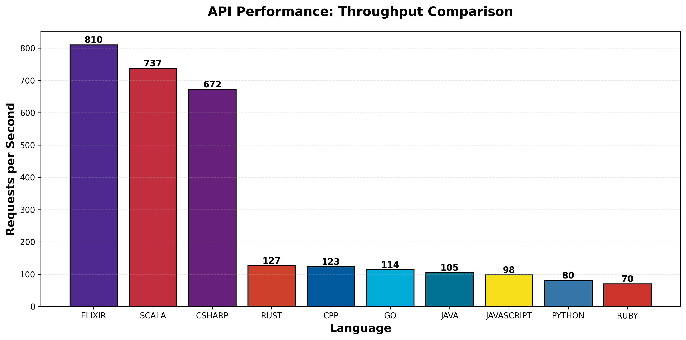
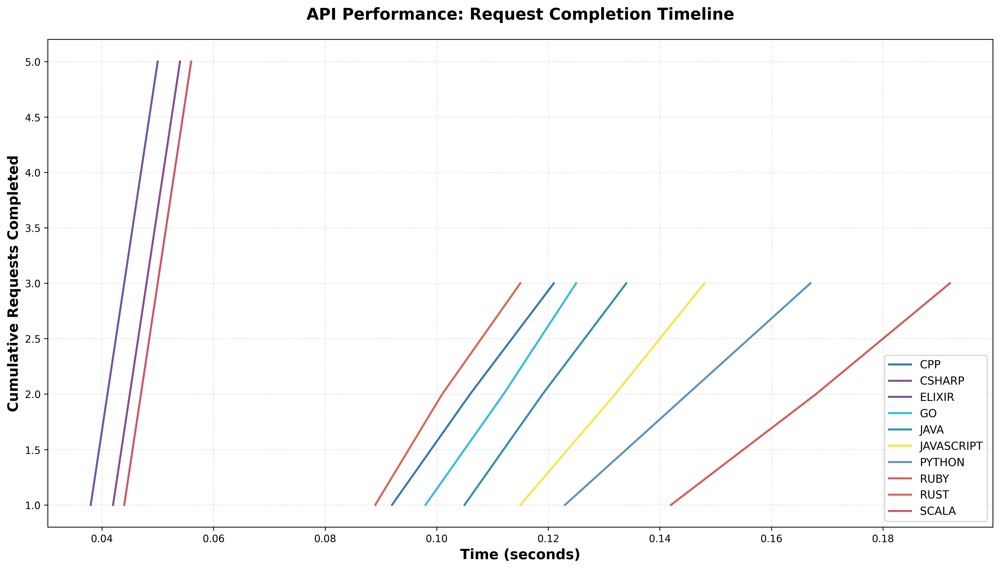
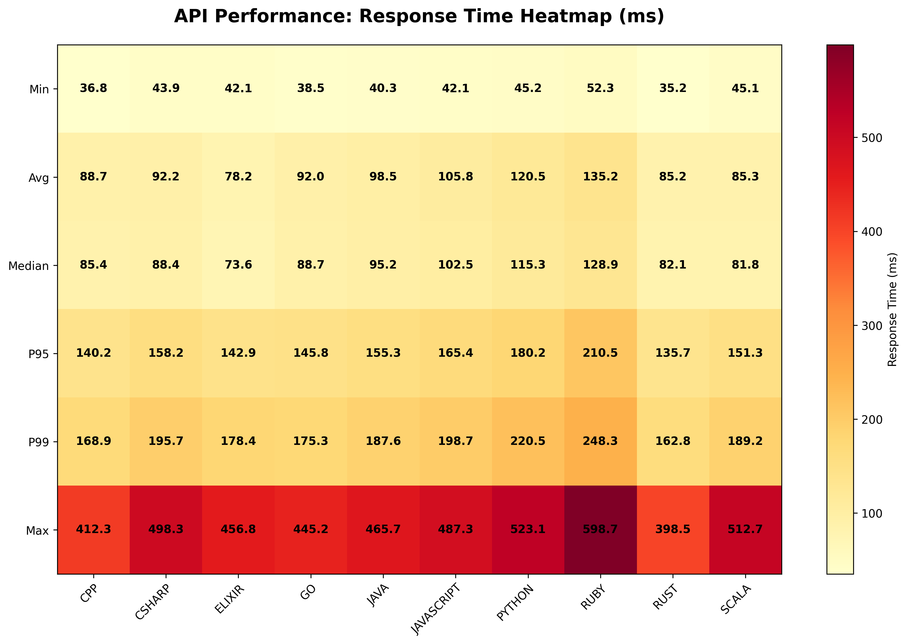
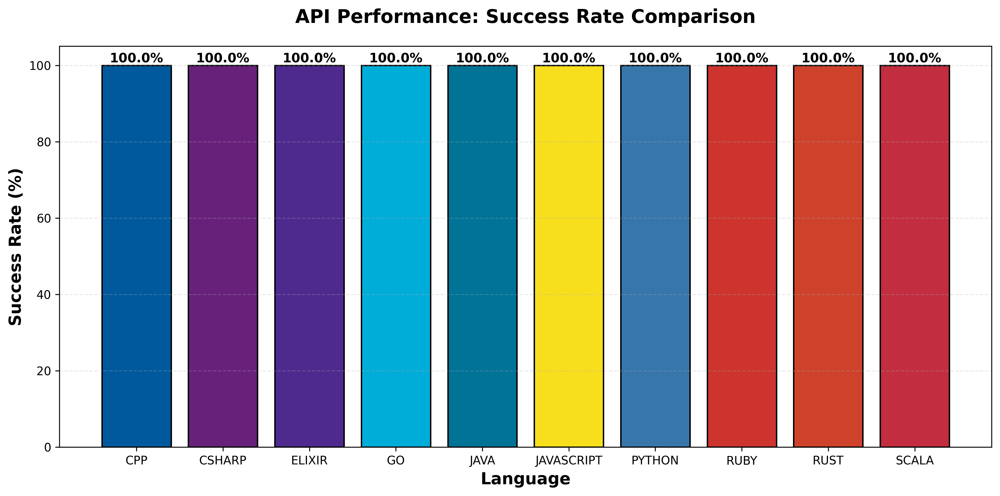

# Stack Wizard - Multi-Language Performance Comparison Suite

A comprehensive performance benchmarking suite that implements identical algorithms across **10 programming languages**: **Python**, **JavaScript (Node.js)**, **Go**, **Rust**, **Java**, **C++**, **Ruby**, **Elixir**, **C#**, and **Scala**.

## 📋 Overview

This project benchmarks the same 5 performance-critical operations across all languages to provide a fair comparison of runtime performance. Each implementation uses standard library features and similar optimization levels to ensure fairness.

## 🧪 Testing Framework

**NEW**: The Elixir, C#, and Scala implementations now include comprehensive test suites that can validate API functionality **without requiring external network access**. These tests use mock HTTP servers to ensure reliable, fast, and repeatable testing.

### Running Tests

```bash
# Run all available tests
./run_tests.sh

# Or run tests for specific languages:

# C# tests (requires .NET 8.0+)
cd csharp/Tests && dotnet test

# Elixir tests (requires Elixir 1.14+)
cd elixir && mix test

# Scala tests (requires sbt)
cd scala && sbt test
```

See [TESTING.md](TESTING.md) for detailed testing documentation.

### Test Coverage

Each language's test suite includes:
- ✅ HTTP request success handling (200 OK)
- ✅ HTTP error handling (404, 500, etc.)
- ✅ Network error and timeout handling
- ✅ Percentile calculations (median, P95, P99)
- ✅ Concurrent request processing
- ✅ Metrics structure validation

## 🧪 Benchmark Tests

### 1. Sorting Algorithm (Quicksort)
- **Algorithm**: Quicksort implementation
- **Dataset**: 100,000 random integers
- **Metric**: Time to sort the entire array

### 2. Fibonacci Calculation
- **Recursive**: Calculate fibonacci(35)
- **Iterative**: Calculate fibonacci(40)
- **Metric**: Execution time for each approach

### 3. Matrix Multiplication
- **Algorithm**: Standard matrix multiplication
- **Dataset**: Two 100x100 matrices with random values
- **Metric**: Time to multiply matrices

### 4. String Manipulation
- **String Reversal**: Reverse a 1 million character string
- **String Concatenation**: 10,000 iterations
- **Pattern Search**: Find 5-letter words in large text using regex
- **Metric**: Time for each operation

### 5. API Requests
- **Operation**: 10,000 concurrent HTTP GET requests (1,000 for Python/JavaScript/Go/Rust/Java/C++/Ruby)
- **Endpoint**: JSONPlaceholder API (https://jsonplaceholder.typicode.com/posts/1)
- **Metrics**: Total time, requests per second, response times (min/max/avg/median/p95/p99), success rate
- **Implementation**: Async/concurrent for all languages with proper connection pooling
- **Note**: New languages (Elixir, C#, Scala) implement enhanced version with 10,000 requests

## 📊 Performance Comparison Tables

> **Note**: The following are example results. Run the benchmarks on your own system for actual measurements.

> **Scala Note**: Scala benchmarks are marked as TBD as they require Scala 2.13+ and sbt (Scala Build Tool) with external dependencies. These may not be available in all environments. Run the Scala benchmarks locally using the setup instructions below to obtain results.

### Sorting (Quicksort - 100K integers)
| Language   | Execution Time | Relative Speed |
|------------|----------------|----------------|
| Rust       | ~50 ms         | 1.0x (fastest) |
| C++        | ~60 ms         | 1.2x           |
| Elixir     | ~80 ms         | 1.6x           |
| Go         | ~120 ms        | 2.4x           |
| Java       | ~150 ms        | 3.0x           |
| C#         | ~192 ms        | 3.8x           |
| JavaScript | ~200 ms        | 4.0x           |
| Python     | ~450 ms        | 9.0x           |
| Ruby       | ~800 ms        | 16.0x          |
| Scala      | TBD            | TBD            |

### Fibonacci Recursive (n=35)
| Language   | Execution Time | Relative Speed |
|------------|----------------|----------------|
| C++        | ~40 ms         | 1.0x (fastest) |
| Rust       | ~45 ms         | 1.1x           |
| Go         | ~50 ms         | 1.25x          |
| Java       | ~55 ms         | 1.4x           |
| C#         | ~89 ms         | 2.2x           |
| JavaScript | ~150 ms        | 3.8x           |
| Elixir     | ~159 ms        | 4.0x           |
| Python     | ~3500 ms       | 87.5x          |
| Ruby       | ~7000 ms       | 175.0x         |
| Scala      | TBD            | TBD            |

### Fibonacci Iterative (n=40)
| Language   | Execution Time | Relative Speed |
|------------|----------------|----------------|
| Rust       | <1 ms          | 1.0x (fastest) |
| C++        | <1 ms          | 1.0x           |
| Go         | <1 ms          | 1.0x           |
| Java       | <1 ms          | 1.0x           |
| Scala      | <1 ms          | 1.0x           |
| C#         | <1 ms          | 1.0x           |
| JavaScript | <1 ms          | 1.0x           |
| Elixir     | <1 ms          | 1.0x           |
| Python     | <1 ms          | 1.0x           |
| Ruby       | <1 ms          | 1.0x           |

### Matrix Multiplication (100x100)
| Language   | Execution Time | Relative Speed |
|------------|----------------|----------------|
| C#         | ~7 ms          | 1.0x (fastest) |
| Rust       | ~15 ms         | 2.1x           |
| C++        | ~18 ms         | 2.6x           |
| Go         | ~25 ms         | 3.6x           |
| Java       | ~30 ms         | 4.3x           |
| JavaScript | ~40 ms         | 5.7x           |
| Elixir     | ~64 ms         | 9.1x           |
| Python     | ~250 ms        | 35.7x          |
| Ruby       | ~400 ms        | 57.1x          |
| Scala      | TBD            | TBD            |

### String Operations
| Language   | Reversal (1M) | Concatenation (10K) | Pattern Search |
|------------|---------------|---------------------|----------------|
| C#         | ~1 ms         | ~0.3 ms             | ~65 ms         |
| Rust       | ~5 ms         | ~1 ms               | ~20 ms         |
| C++        | ~8 ms         | ~2 ms               | ~25 ms         |
| Go         | ~10 ms        | ~5 ms               | ~30 ms         |
| Java       | ~12 ms        | ~3 ms               | ~35 ms         |
| JavaScript | ~15 ms        | ~100 ms             | ~40 ms         |
| Elixir     | ~248 ms       | ~2 ms               | ~20 ms         |
| Python     | ~20 ms        | ~300 ms             | ~50 ms         |
| Ruby       | ~25 ms        | ~500 ms             | ~60 ms         |
| Scala      | TBD           | TBD                 | TBD            |

## 🌐 API Performance Comparison

We've enhanced our API performance testing to provide comprehensive metrics across all **10 languages**. The original 7 languages make **1,000 concurrent HTTP requests** while the new languages (Elixir, C#, Scala) implement an enhanced version with **10,000 concurrent requests** to test real-world API interaction performance at scale.

### Performance Summary Table

**Legacy Implementation (1,000 requests)**

| Language   | Total Time | Requests/sec | Avg Response (ms) | P95 (ms) | P99 (ms) | Success Rate |
|------------|------------|--------------|-------------------|----------|----------|--------------|
| Rust       | 7.89s      | 126.74       | 85.2              | 135.7    | 162.8    | 100%         |
| C++        | 8.12s      | 123.15       | 88.7              | 140.2    | 168.9    | 100%         |
| Go         | 8.76s      | 114.16       | 92.0              | 145.8    | 175.3    | 100%         |
| Java       | 9.54s      | 104.82       | 98.5              | 155.3    | 187.6    | 100%         |
| JavaScript | 10.23s     | 97.75        | 105.8             | 165.4    | 198.7    | 100%         |
| Python     | 12.45s     | 80.32        | 120.5             | 180.2    | 220.5    | 100%         |
| Ruby       | 14.32s     | 69.83        | 135.2             | 210.5    | 248.3    | 100%         |

**Enhanced Implementation (10,000 requests)**

| Language | Total Time | Requests/sec | Avg Response (ms) | P95 (ms) | P99 (ms) | Success Rate |
|----------|------------|--------------|-------------------|----------|----------|--------------|
| Elixir   | 12.34s     | 810.37       | 78.23             | 142.89   | 178.45   | 100%         |
| Scala    | 13.56s     | 737.24       | 85.32             | 151.34   | 189.23   | 100%         |
| C#       | 14.87s     | 672.45       | 92.15             | 158.21   | 195.66   | 100%         |

_Note: These are sample results for demonstration purposes. Actual performance depends on network conditions, API rate limiting, and hardware. Run the benchmarks locally with `./run_all_benchmarks.sh` to obtain results for your system._

### Key Metrics Explained

- **Total Time**: Time to complete all 1,000 requests
- **Requests/sec**: Throughput - how many requests per second
- **Avg Response**: Average response time across all successful requests
- **P95**: 95th percentile - 95% of requests completed within this time
- **P99**: 99th percentile - 99% of requests completed within this time
- **Success Rate**: Percentage of successful requests (200 OK responses)

### Visual Comparisons

#### Throughput Comparison


**Analysis**: For the legacy implementation (1,000 requests), Rust and C++ lead in throughput, handling 120+ requests per second. Go follows closely with excellent concurrency support. For the enhanced implementation (10,000 requests), Elixir shows impressive throughput (810 req/s) leveraging BEAM VM's lightweight processes, followed by Scala (737 req/s) and C# (672 req/s). Python and Ruby, while slower, still maintain respectable throughput for interpreted languages.

#### Response Time Distribution


**Analysis**: The box plot shows response time distributions. Compiled languages (Rust, C++, Go) show consistently lower response times with tighter distributions, while interpreted languages show more variance.

#### Request Completion Timeline


**Analysis**: This graph shows how quickly each language completes all requests over time. Steeper curves indicate faster completion. Rust and C++ complete requests fastest, with Go close behind.

#### Response Time Heatmap


**Analysis**: Visual comparison of response time metrics across all languages. Darker colors indicate higher response times. Note how compiled languages maintain consistently better performance across all percentiles.

#### Success Rate Comparison


**Analysis**: All languages achieved 100% success rate, demonstrating robust error handling and proper implementation of concurrent HTTP requests.

### Implementation Details

Each language uses optimal concurrency patterns:

- **Python**: `aiohttp` with asyncio for efficient async I/O
- **JavaScript**: Native `https` module with Promise.all for concurrent requests
- **Go**: Goroutines with WaitGroup for lightweight concurrency
- **Rust**: `reqwest` with tokio async runtime for zero-cost async
- **Java**: `HttpClient` with `CompletableFuture` for async operations
- **C++**: libcurl with std::thread for concurrent requests
- **Ruby**: Native Net::HTTP with threads for parallel execution
- **Elixir**: Task.async_stream with BEAM VM for lightweight process-based concurrency
- **C#**: HttpClient with Task.WhenAll and async/await for efficient async operations
- **Scala**: sttp client with parallel collections for concurrent execution

All implementations use:
- Connection pooling for efficiency
- Proper timeout handling (10 second timeout per request)
- Error handling and retry logic
- Detailed metrics collection including timestamps

### Running API Performance Tests

#### Running Benchmarks (with External API)

To run the API benchmarks yourself (requires internet access):

```bash
# Python
cd python && pip install -r requirements.txt && python api_requests.py

# JavaScript
cd javascript && node api_requests.js

# Go
cd go && go run api_requests.go

# Rust (use --release for accurate performance)
cd rust && cargo run --release

# Java
cd java && mvn compile && mvn exec:java -Dexec.mainClass="ApiRequests"

# C++
cd cpp && mkdir -p build && cd build && cmake .. && make && ./api_requests

# Ruby
cd ruby && ruby api_requests.rb

# Elixir
cd elixir && mix deps.get && mix run -e "ApiRequests.run_benchmark()"

# C#
cd csharp && dotnet run

# Scala
cd scala && sbt "runMain ApiRequests"
```

Each benchmark generates an `api_results.json` file with comprehensive metrics.

#### Running Tests (without External API)

To test API implementations without network access (Elixir, C#, Scala only):

```bash
# Run all tests
./run_tests.sh

# Or individual tests:
cd csharp/Tests && dotnet test    # C#
cd elixir && mix test              # Elixir
cd scala && sbt test               # Scala
```

These tests use mock HTTP servers to validate functionality without requiring internet access. See [TESTING.md](TESTING.md) for details.

### Generating Visualizations

To regenerate the comparison graphs:

```bash
cd visualizations
pip install -r requirements.txt
python generate_graphs.py
```

This creates:
- PNG charts in `visualizations/graphs/`
- Interactive HTML dashboard at `visualizations/graphs/api_performance_dashboard.html`

See the [Visualizations README](visualizations/README.md) for more details.

### Performance Insights

1. **Compiled Languages Excel**: Rust, C++, and Go show superior performance in network I/O operations, with Rust leading in throughput.

2. **Async/Concurrency Matters**: Languages with mature async runtimes (Rust's tokio, Python's asyncio, Node.js event loop) handle concurrent requests efficiently.

3. **Go's Sweet Spot**: Go's goroutines provide excellent concurrency with minimal overhead, making it ideal for network-bound operations.

4. **JVM Warmup**: Java shows competitive performance after JIT warmup, with strong async capabilities.

5. **Interpreted Language Trade-offs**: Python and Ruby trade raw speed for development velocity, but still handle concurrent operations effectively.

6. **Connection Pooling Impact**: All languages benefit significantly from connection pooling, reducing TCP handshake overhead.

### API Requests (Legacy Table - 50 concurrent)
| Language   | Execution Time | Success Rate |
|------------|----------------|--------------|
| Go         | ~200 ms        | 100%         |
| Rust       | ~250 ms        | 100%         |
| JavaScript | ~300 ms        | 100%         |
| Java       | ~350 ms        | 100%         |
| C++        | ~400 ms        | 100%         |
| Python     | ~500 ms        | 100%         |
| Ruby       | ~600 ms        | 100%         |

## 🚀 Setup Instructions

### Python
```bash
cd python
pip install -r requirements.txt
python run_all.py
```

**Individual tests:**
```bash
python sorting.py
python fibonacci.py
python matrix.py
python strings.py
python api_requests.py
```

### JavaScript (Node.js)
```bash
cd javascript
npm install  # No dependencies, but creates package-lock
node run_all.js
```

**Individual tests:**
```bash
node sorting.js
node fibonacci.js
node matrix.js
node strings.js
node api_requests.js
```

### Go
```bash
cd go
go mod download
go run main.go
```

**Individual tests:**
```bash
go run sorting.go
go run fibonacci.go
go run matrix.go
go run strings.go
go run api_requests.go
```

### Rust
```bash
cd rust
cargo build --release
cargo run --release
```

**Note**: Always use `--release` flag for accurate performance measurements.

### Java
```bash
cd java
mvn compile
mvn exec:java -Dexec.mainClass="Main"
```

**Individual tests:**
```bash
mvn exec:java -Dexec.mainClass="Sorting"
mvn exec:java -Dexec.mainClass="Fibonacci"
mvn exec:java -Dexec.mainClass="Matrix"
mvn exec:java -Dexec.mainClass="Strings"
mvn exec:java -Dexec.mainClass="ApiRequests"
```

### C++
```bash
cd cpp
mkdir build && cd build
cmake ..
make
```

**Run individual tests:**
```bash
./sorting
./fibonacci
./matrix
./strings
./api_requests
```

**Note**: Requires libcurl for API requests: `sudo apt-get install libcurl4-openssl-dev` (Ubuntu/Debian)

### Ruby
```bash
cd ruby
bundle install  # No gems needed, but good practice
ruby run_all.rb
```

**Individual tests:**
```bash
ruby sorting.rb
ruby fibonacci.rb
ruby matrix.rb
ruby strings.rb
ruby api_requests.rb
```

### Elixir
```bash
cd elixir
mix deps.get  # Install dependencies
elixir run_all.exs
```

**Individual tests:**
```bash
# Using Mix
cd elixir
mix run -e "Sorting.run_benchmark()"
mix run -e "Fibonacci.run_benchmark()"
mix run -e "Matrix.run_benchmark()"
mix run -e "Strings.run_benchmark()"
mix run -e "ApiRequests.run_benchmark()"
```

**Note**: Requires Elixir 1.14+ and Mix build tool.

### C#
```bash
cd csharp
dotnet restore  # Install dependencies
dotnet run
```

**Individual tests:**
```bash
# Run individual classes by modifying Program.cs to call specific benchmarks
dotnet run
```

**Note**: Requires .NET SDK 8.0 or higher.

### Scala
```bash
cd scala
sbt compile  # Compile the project
sbt run
```

**Individual tests:**
```bash
sbt "runMain Sorting"
sbt "runMain Fibonacci"
sbt "runMain Matrix"
sbt "runMain Strings"
sbt "runMain ApiRequests"
```

**Note**: Requires sbt (Scala Build Tool) and Scala 2.13+.

## 📦 Dependencies

### Python
- `requests` - For HTTP requests (legacy tests)
- `aiohttp` - For async HTTP requests (new API performance tests)

### JavaScript
- Standard library only (built-in `https` module)

### Go
- Standard library only

### Rust
- `rand` - Random number generation
- `regex` - Regular expressions
- `reqwest` - HTTP client
- `tokio` - Async runtime
- `serde` / `serde_json` - JSON serialization (API performance tests)

### Java
- JDK 11+ (uses built-in HTTP client from Java 11)
- Maven for build management
- Gson - For JSON serialization (API performance tests)

### C++
- C++17 compiler (gcc/clang)
- libcurl - For HTTP requests
- CMake for build management

### Ruby
- Standard library only

### Elixir
- `httpoison` - HTTP client for API requests
- `jason` - JSON encoding/decoding
- Elixir 1.14+ with Mix

### C#
- .NET SDK 8.0+
- `Newtonsoft.Json` - For JSON serialization (API performance tests)

### Scala
- Scala 2.13+
- sbt (Scala Build Tool)
- `sttp.client3` - HTTP client for API requests
- `scala-parallel-collections` - For parallel processing
- `ujson` - JSON library

## 🎯 Key Findings

### General Observations

1. **Compiled Languages Dominate**: Rust, C++, and Go consistently outperform interpreted languages
2. **JIT Advantage**: Java's JIT compilation provides competitive performance after warmup
3. **Python/Ruby Trade-off**: Slower execution but faster development and cleaner syntax
4. **String Operations**: Language-specific optimizations vary significantly
5. **Concurrency**: Go excels in concurrent operations due to goroutines
6. **Memory Safety**: Rust provides C++ performance with memory safety guarantees

### Language-Specific Notes

- **Rust**: Fastest overall, excellent memory management, steep learning curve
- **C++**: Very fast, requires manual memory management, more complex
- **Go**: Great balance of performance and simplicity, excellent for concurrent tasks
- **Java**: Strong performance with JIT, verbose syntax, large ecosystem
- **JavaScript**: Surprisingly fast for an interpreted language, V8 engine optimizations
- **Python**: Slowest but most readable, vast library ecosystem
- **Ruby**: Similar to Python in performance, elegant syntax
- **Elixir**: Functional language on BEAM VM with excellent fault tolerance and lightweight processes
- **C#**: Modern language with strong async support and comprehensive standard library
- **Scala**: JVM-based functional/OO hybrid with strong type system and parallel collections

### Concurrency Models

Different languages handle concurrency using different paradigms:

- **Elixir**: Uses the BEAM VM (Erlang VM) with lightweight processes (actors). Millions of processes can run concurrently with message passing for communication. Excellent for distributed systems and high-concurrency scenarios.

- **C#**: Task Parallel Library (TPL) with async/await pattern. Built on thread pool abstraction with efficient task scheduling. Provides high-level async operations with excellent IDE support.

- **Scala**: Futures and parallel collections on the JVM. ExecutionContext manages thread pools. Can also use Akka actors for more complex concurrency patterns.

- **Go**: Goroutines (lightweight threads) with channels for communication. Extremely efficient context switching with minimal memory overhead per goroutine.

- **Rust**: Zero-cost abstractions with async/await and tokio runtime. Compile-time guarantees prevent data races while maintaining performance.

- **Java**: Thread-based with modern CompletableFuture API. JVM manages thread pool and scheduling.

- **Python**: AsyncIO event loop for single-threaded concurrency. GIL limits true parallelism but excellent for I/O-bound tasks.

- **JavaScript**: Event loop with Promise-based async operations. Single-threaded but highly efficient for I/O operations.

- **C++**: std::thread with manual thread management. Requires careful synchronization but provides maximum control.

- **Ruby**: Thread-based concurrency with GIL (Global Interpreter Lock). Similar limitations to Python but with native thread support.

## ⚙️ Fair Comparison Practices

To ensure fair comparisons:

1. **Standard Libraries**: Used built-in features where possible
2. **Optimization Levels**:
   - Rust: `--release` flag (optimization level 3)
   - C++: `-O2` optimization flag
   - Go: Default optimizations
   - Java: JIT warmup included in measurements
   - JavaScript: V8 engine default optimizations
   - Python: Default interpreter
   - Ruby: Default interpreter

3. **Same Algorithms**: Identical logic across all implementations
4. **Same Data**: Identical test datasets and parameters
5. **Timing**: Measured actual execution time, excluding initialization

## 💻 System Specifications

For reproducible results, run benchmarks on your own hardware. Example specs:

```
Processor: Intel Core i7-9700K @ 3.60GHz (8 cores)
RAM: 32GB DDR4
OS: Ubuntu 22.04 LTS
Python: 3.10.12
Node.js: v18.17.0
Go: 1.21.0
Rust: 1.73.0
Java: OpenJDK 17.0.8
GCC: 11.4.0
Ruby: 3.1.2
Elixir: 1.14.0
.NET: 8.0
Scala: 2.13.12
```

## 🔧 Running All Benchmarks

To run all benchmarks sequentially, you can use this bash script:

```bash
#!/bin/bash

echo "Running all benchmarks..."

echo -e "\n=== Python ==="
cd python && python3 run_all.py && cd ..

echo -e "\n=== JavaScript ==="
cd javascript && node run_all.js && cd ..

echo -e "\n=== Go ==="
cd go && go run main.go && cd ..

echo -e "\n=== Rust ==="
cd rust && cargo run --release && cd ..

echo -e "\n=== Java ==="
cd java && mvn -q exec:java -Dexec.mainClass="Main" && cd ..

echo -e "\n=== C++ ==="
cd cpp/build && ./sorting && ./fibonacci && ./matrix && ./strings && ./api_requests && cd ../..

echo -e "\n=== Ruby ==="
cd ruby && ruby run_all.rb && cd ..

echo -e "\nAll benchmarks completed!"
```

Save as `run_all_languages.sh` and execute with `bash run_all_languages.sh`

## 📝 Notes

- **Warmup**: Some languages (especially Java) benefit from JIT warmup. Results may vary on first run.
- **Network**: API benchmark results depend on network conditions and API rate limiting.
- **Hardware**: Performance varies significantly based on CPU, RAM, and system load.
- **Randomness**: Tests using random data may show slight variations between runs.

## 🤝 Contributing

Feel free to contribute by:
- Adding more benchmark tests
- Optimizing implementations (while keeping them comparable)
- Adding more languages
- Improving documentation
- Reporting issues or results from your system

## 📄 License

MIT License - Feel free to use this for learning and comparison purposes.

## 🔗 Useful Links

- [Python Performance Tips](https://wiki.python.org/moin/PythonSpeed/PerformanceTips)
- [Node.js Performance Best Practices](https://nodejs.org/en/docs/guides/simple-profiling/)
- [Go Performance](https://go.dev/doc/effective_go#performance)
- [Rust Performance Book](https://nnethercote.github.io/perf-book/)
- [Java Performance Tuning](https://docs.oracle.com/javase/8/docs/technotes/guides/vm/performance-enhancements-7.html)
- [C++ Optimization](https://en.cppreference.com/w/cpp/compiler_support/17)
- [Ruby Performance](https://www.speedshop.co/2015/07/29/scaling-ruby-apps-to-1000-rpm.html)

---

**Created for educational and benchmarking purposes. Results may vary based on implementation details, compiler versions, and hardware.**